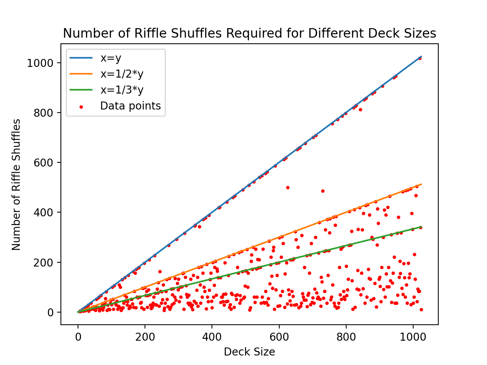

# Riffle Shuffle Project

The Riffle Shuffle Project aims to simulate and analyze the riffle shuffle technique used in card shuffling. It explores the relationship between the size of the deck and the number of riffle shuffles required for the deck to return to its original order. This project utilizes Python, NumPy, and Matplotlib.

## Methodology
The project follows a step-by-step approach, after a deck size is defined:

1. Deck Splitting: The deck of cards is initially split into two equal halves. This splitting mimics the typical action of splitting the deck into two piles before performing a riffle shuffle.

2. Riffle Shuffle: The riffle shuffle is performed on the deck by interleaving the cards from the two halves. This process involves alternately selecting cards from each half and placing them into a new shuffled deck.

3. Shuffle Analysis: The number of riffle shuffles required for the deck to return to its original order is determined. This analysis is conducted for various deck sizes, starting from 2 and increasing incrementally.

4. Visualization: The results of the analysis are plotted using Matplotlib. The deck sizes are represented on the x-axis, while the corresponding number of riffle shuffles is displayed on the y-axis. Additionally, reference lines for x=y, x=1/2y, and x=1/3y are included to aid in visualizing any patterns or relationships.

By following this methodology, the Riffle Shuffle Project provides insights into the behavior of the riffle shuffle technique and how it relates to the size of the deck. The generated plots and analysis contribute to a better understanding of the mathematical aspects and patterns associated with riffle shuffling in card games.

## Usage

1. Enter the maximum deck number you want to analyze.

2. The program will calculate the number of riffle shuffles required for each deck size and display the results.

3. The program will also plot the deck sizes on the x-axis and the corresponding number of riffle shuffles on the y-axis. The graph will include the data points as well as reference lines for x=y, x=1/2*y, and x=1/3*y.

## Results and Analysis

The results of this experiment are shown as follows, for number of riffle shuffles to obtain the original deck, for decks containing up to 1,024 cards:

The number of perfect riffle shuffles for decks containing up to 1,024 cards exhibits intriguing patterns. In particular, the graph may display diagonal lines with slopes that are approximately equal to 1, 1/2, and 1/3. This observation aligns with the findings from the article by [Rick Wicklin](https://blogs.sas.com/content/iml/2018/09/24/perfect-riffle-shuffles.html).

The article mentions that the integer sequence P(N) is related to the "multiplicative order of 2 mod 2n+1" in the On-Line Encyclopedia of Integer Sequences (OEIS). The OEIS provides a graph similar to the one shown in the article, but computed for N ≤ 10,000. The graph demonstrates the number of perfect riffle shuffles for decks with an even number of cards.

For even values of N, P(N) represents the smallest value of k for which 2^k is congruent to 1 (mod N–1). The article provides an example where P(N) is computed explicitly: mod(2^8, 51) equals 1, indicating that 8 is the smallest value satisfying the congruence.

Additionally, the graph points out that the values of P(N) = N-1 correspond to prime numbers. However, it is worth noting that not all prime numbers are included in this specific list.

The program outputs the deck size and the number of riffle shuffles required for each deck size. Moreover, the generated graph visually illustrates the relationship between deck size and the number of riffle shuffles.

## Contributing

Contributions to this project are welcome. If you encounter any issues or have suggestions for improvements, please feel free to open an issue or submit a pull request.

## License

This project is licensed under the [MIT License](LICENSE).
